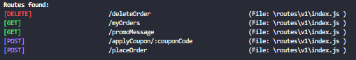

## Final Project submitted by singh.jaskaran2024@gmail.com [Celebal_Technologies] CSI Nodejs Backend Internship 2025

# 👟 Shoe Selling App - BareFoot

> A full-featured e-commerce platform for showcasing and selling shoes.  
> Built using Nodejs, powered with **Auth0**

## Features

- User Authentication with **Auth0**
- OTP-based Email Verification
- Rate Limiting
- Add to Cart, Choose Size, Place Orders, Add Shoe, Add Shoe Variants, update shoe Variants
- Apply Coupons and Promo Codes
- Admin Panel: Upload Products, Add Images & Variants
- Redis Caching for Super Fast API Responses
- Email Notifications with Nodemailer

In this project I've implemented microservices. Each service has been deployed independently on render(deploying platform).

Role Based Access Control: Managed by Auth0
The MVP of this backend project can be viewed on https://upes.vercel.app

To access features available to admins use - Id: jaskaranyt123@gmail.com - Password: !Qw12345

Routes Implemented:

1. CartService:
   
2. OrderService:
   
3. ProductService
   
4. OrderService
   
5. VerificationService
   

The current folder is a monorepo. To view each service in detail. Their repository links on my profile are:

1. ApiGateway: https://github.com/prestigious-protagonist/BareFoot_ApiGateway
   Deployed at: https://barefoot-apigateway.onrender.com

2. CartService: https://github.com/prestigious-protagonist/BareFoot_CartService
   Deployed at: https://barefoot-cartservice.onrender.com

3. ProductService: https://github.com/prestigious-protagonist/BareFoot_ProductService
   Deployed at: https://barefoot-productservice.onrender.com

4. OrderService: https://github.com/prestigious-protagonist/BareFoot_OrderService
   Deployed at: https://barefoot-orderservice.onrender.com

5. VerificationService: https://github.com/prestigious-protagonist/BAREFOOT_VerificationService
   Deployed at: https://barefoot-verificationservice.onrender.com
