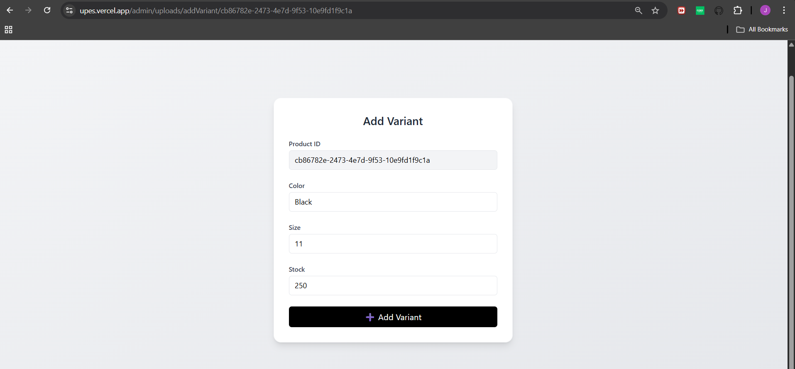

## Final Project submitted by singh.jaskaran2024@gmail.com [Celebal_Technologies] CSI Nodejs Backend Internship 2025

# 👟 Shoe Selling App - BareFoot

> A full-featured e-commerce platform for showcasing and selling shoes.  
> Built using Nodejs, powered with **Auth0**

## Features

- Microservices Architecture
- User Authentication with **Auth0**
- OTP-based Email Verification for addresses
- Rate Limiting
- Add to Cart, Choose Size, Place Orders, Add Shoe, Add Shoe Variants, update shoe Variants
- Add favourites, remove Favourites
- Apply Coupons and Promo Codes
- Admin Panel: Upload Products, Add Images & Variants
- Redis Caching for Super Fast API Responses
- Email Notifications with Nodemailer

In this project I've implemented microservices. Each service has been deployed independently on render(deploying platform).

Role Based Access Control: Managed by Auth0  
Application could be slow as it is deployed under the free tier plan.  
Each request after a specific time of inactivity leads to the cold start of the complete service.  
So for the first time features might take 15-20 seconds to load.  
Some routes are yet to be implemented, this frontend is the minimal representation of the product.  
The MVP of this backend project can be viewed on <i>https://upes.vercel.app</i>

To access features available to admins use - Id: jaskaranyt123@gmail.com - Password: !Qw12345

Routes Implemented:

1. CartService: 
   
2. OrderService: 
   
3. ProductService 
   
4. OrderService 
   
5. VerificationService 
   

The current folder is a monorepo. To view each service in detail. Their repository links on my github profile are:

1. ApiGateway: https://github.com/prestigious-protagonist/BareFoot_ApiGateway  
   Deployed at: https://barefoot-apigateway.onrender.com 

2. CartService: https://github.com/prestigious-protagonist/BareFoot_CartService 
   Deployed at: https://barefoot-cartservice.onrender.com 

3. ProductService: https://github.com/prestigious-protagonist/BareFoot_ProductService 
   Deployed at: https://barefoot-productservice.onrender.com 

4. OrderService: https://github.com/prestigious-protagonist/BareFoot_OrderService 
   Deployed at: https://barefoot-orderservice.onrender.com 

5. VerificationService: https://github.com/prestigious-protagonist/BAREFOOT_VerificationService 
   Deployed at: https://barefoot-verificationservice.onrender.com
    

Screenshots from https://upes.vercel.app

1. Home page 
    
2. Cart 
    
3. Favourites 
    
4. My Orders 
    
5. Product 
    
6. Add to Cart 
    

### Admin Specific Features

1. Add a new Product 
    
2. Provide product description 
    
3. Updated Product List 
    
4. Provide Variant: Though we have created a product, we must provide it a variant before uploading its picture. Eg. Black shoe is a variant of a product. 
    
5. Adding Variant 
    
6. Variant Added 
    
7. Add Image for the variant: 
    
8. Adding Image: List of variants will be shown here. Add image for the desired product. 
    
9. Image Uploaded Successfully 
    
10. View the newly added product 
     

### Place Order

1. Review your order 
    
2. Use Coupons 
    
3. Verify Address before placing the order 
    
4. Send OTP 
    
5. OTP sent 
    
6. Check OTP 
    
7. Email verified 
    
8. Place Order  
    
9. Order Placed  
    
10. Order Confirmation
     
11. Order Confirmation Mail
     
